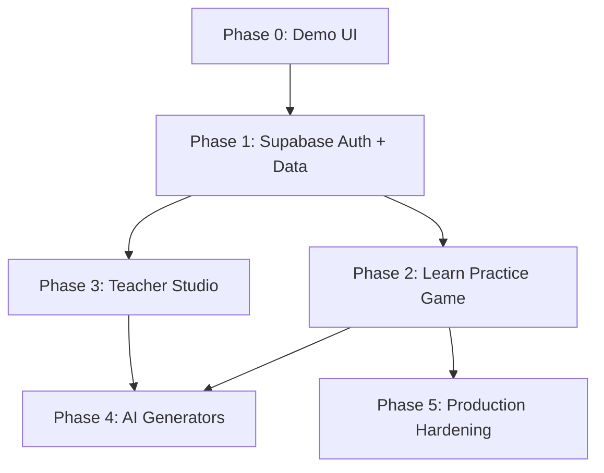

# Green Freedom Academy — Roadmap

**Playbook version:** 1.0  
**Status legend:** CURRENT · IN PROGRESS · PLANNED · FUTURE

This roadmap reflects the **actual repository state** as of v1.0.0. Items are not marked complete unless implemented in code.

---

## Status Overview

```
CURRENT          Demo UI, one lesson, static dashboards, schema file
IN PROGRESS      (none tracked in repository)
PLANNED          Supabase auth, persistence, Practice & Game engines
FUTURE           AI generators, Teacher Studio, Classroom Companion
```

---

## Phase 0 — Foundation (CURRENT ✅)

**Goal:** Runnable demo that demonstrates the product vision to teachers and stakeholders.

| Feature | Status | Notes |
|---------|--------|-------|
| Next.js 15 App Router setup | CURRENT | `app/` routes |
| Landing page (`/`) | CURRENT | Marketing hero, feature grid |
| Demo login (`/login`) | CURRENT | Role tabs; stores `gfa-demo-role` in `localStorage`; no credential check |
| Student Learning Home (`/student`) | CURRENT | Action-oriented learner entry: Resume Learning, active lesson, compact curriculum progress, latest activity |
| Teacher dashboard (`/teacher`) | CURRENT | Hardcoded stats and student table |
| Present Simple lesson (`/lesson/present-simple`) | CURRENT | 8 Learn cards covering usage, affirmative, -s/-es, negatives, Yes/No + short answers, Wh-questions, frequency/time, and a structure summary; last card records Learn completion |
| `BrandHeader` component | CURRENT | Shared nav across main pages |
| Global CSS design system | CURRENT | `app/globals.css` |
| PWA manifest | CURRENT (partial) | `public/manifest.webmanifest`; `icons: []` |
| Supabase browser client stub | CURRENT (unused) | `lib/supabase-browser.ts` — not imported anywhere |
| Database schema SQL | CURRENT (file only) | `supabase/schema.sql` — not applied by app |
| README local dev + Vercel deploy | CURRENT | Thai instructions |
| Learning history repository | CURRENT | Memory + browser `localStorage` (`gfa.learningHistory.v1`); no Supabase writes |
| Activity completion recording | CURRENT | Completed quiz, millionaire, flash-cards, and Learn save `LearningEvent`s through the history repository |
| Student dashboard history | CURRENT | `/dashboard` is analytics/progress detail; reads real persisted events only; no automatic sample seeding |
| Learning path recommendation | CURRENT | Deterministic next-best-action for the active curriculum lesson (not latest activity) |
| Learning journey / progression | CURRENT | Curriculum-order active lesson (not latest activity) with per-lesson Learn → Practice → Play → Review → Complete |
| Curriculum progress dashboard | CURRENT | Deterministic per-lesson status + overall average progress on `/dashboard` (display only, not access control) |
| Resume learning | CURRENT | One primary return-and-continue CTA projected from curriculum-aware Recommendation; primary on Student Home, compact on `/dashboard` |
| Student learning flow integration | CURRENT | Home → lesson → quiz/millionaire/flash-cards → save → Home resume; result screens return to `/student` |
| Lesson entry progress UX | CURRENT | Lesson pages show active/complete/out-of-order status from existing analytics; display only, no route locking |
| End-to-end student journey verification | CURRENT | Deterministic Home / Lesson Entry / Quiz / Millionaire / curriculum / dashboard / hydration checks on the existing policy |
| Learn → Short Practice continuity | CURRENT | After a persisted Learn event, Journey / Recommendation / Resume / Home / Lesson Entry point to Quiz (`ทำ Quiz`) |
| Short Practice Quiz length | CURRENT | Default Quiz attempt is 10 questions; percentage scoring unchanged; answer positions stay near-balanced (3/3/2/2) |
| Activity Result forward CTA | CURRENT | After persist, Quiz Result follows the current attempt: weak `ทำ Quiz อีกครั้ง`, developing `ฝึก Quiz` (intro retry), strong `เล่น Millionaire`. Millionaire Result follows the current attempt: weak `ฝึก Quiz อีกครั้ง`, developing `เล่น Millionaire อีกครั้ง` (intro replay), strong next lesson or dashboard. Home / Journey / Resume still use historical averages. |
| Present Simple 10-stage game | CURRENT | Millionaire student-facing identity is `เกมพิชิต 10 ด่าน`: colorful hero world, pilot explorer character, display-only Adventure Map, and explicit continue after feedback. Assessment stays 10 of 50, percentage scoring, 70/85 bands, and Sprint 41 Result routing. Quiz keeps the shared `.millionaire*` styles. |
| Complete Present Simple Learn | CURRENT | Learner is taught the assessed Present Simple foundation before Short Practice. Quiz and Millionaire still use the existing 50-item bank (10 questions each) |
| Guided Student Learn | CURRENT | `/lesson/[slug]` walks Sections 1–8 with one dominant footer action, then persists Learn on Section 8 and continues to Quiz. Teacher `?from=teacher` keeps classroom chrome |
| Lesson content versioning | CURRENT | Learn completion is per lesson + `contentVersion`. Legacy unversioned Learn events are v1. Stale Present Simple Learn-only history stays LEARN until current v2 is completed |
| Student visual foundation | CURRENT | Additive `--gfa-*` tokens and `GfaLearningWorld` (ลานเขียวอิสระ / Everyday Garden). Present Simple Section 1 is Visual Master v1 (owner-approved, frozen). Sections 2–7 are frozen Learn compositions (playground / workshop / Quiet Shelter / Question Booth / Clue Trail / Clock Garden). Section 8 is an owner-review Clubhouse Map prototype. Quiz uses a dedicated Practice Garden two-zone stage (card + Bai Tong coach) awaiting owner visual approval. Millionaire stays on its existing surface. Contract: `ASSET-CONTRACT.md` |

**Known gaps in Phase 0:**

- Demo role in `localStorage` is written but never read for route guards.
- Teacher dashboard still uses hardcoded demo stats; Student Home no longer uses fake XP.
- Teacher "สร้างห้องเรียน" button has no handler.
- Coming-soon activities (matching, monopoly, spin-wheel, sentence-builder) have no completion recording yet.
- Curriculum currently has two registry lessons (Present Simple, then Past Simple). Completing the final lesson returns to `/dashboard`; there is no invented third lesson.
- Present Simple is the only learner-launchable lesson in the current pilot. After Present Simple COMPLETE, `/student` and dashboard CTAs go to `/dashboard` rather than `/lesson/past-simple`. Curriculum engines still identify Past Simple as next; the lesson remains directly reachable by URL. Learner-facing progress for non-launchable Past Simple is presented as next/unavailable/0%.

---

## Phase 1 — Backend Integration (PLANNED)

**Goal:** Real users, real data, secure access.

| Feature | Status | Notes |
|---------|--------|-------|
| Supabase project setup | PLANNED | Documented in README |
| Environment variables (`.env.local`) | PLANNED | Template in `.env.example` |
| Supabase Auth (email/password or OAuth) | PLANNED | Replace demo login |
| Profile creation on signup | PLANNED | `profiles` table exists in schema |
| Server-side Supabase client | PLANNED | Not in repo yet |
| Auth middleware / route protection | PLANNED | `/student`, `/teacher` currently open |
| Row Level Security completion | PLANNED | Only `profiles` and `student_progress` have policies today |
| Student progress persistence | PLANNED | Completed quiz / millionaire / flash-cards / Learn persist in the browser today; `student_progress` table still unused |
| Classroom create / join | PLANNED | `classrooms` table defined; UI button only |

**Exit criteria:** Teacher and student log in with real accounts; lesson completion saves to Supabase; dashboards read live data.

---

## Phase 2 — Learning Engines (PLANNED)

**Goal:** Complete the **Learn → Short Practice → Game** loop for P.6 English.

| Feature | Status | Notes |
|---------|--------|-------|
| Lesson content from database | PLANNED | `lessons.content` JSONB in schema |
| Generic lesson viewer component | PLANNED | Replace hardcoded slide arrays |
| Short Practice engine | PLANNED | Activity routes exist; engine work continues |
| Millionaire / Game engine | PLANNED | Activity routes exist; engine work continues |
| XP and badge system | PLANNED | Not shown on Student Home |
| Course catalog (`courses` table) | PLANNED | Schema only |

**Exit criteria:** One full P.6 English unit runs Learn → Practice → Game with progress saved per student.

---

## Phase 3 — Teacher Studio (PLANNED → FUTURE)

**Goal:** Teachers manage content and classes without developer help.

| Feature | Status | Notes |
|---------|--------|-------|
| Teacher Studio UI | FUTURE | Beyond current demo dashboard |
| Class roster management | PLANNED | Depends on Phase 1 classrooms |
| Per-student progress reports | PLANNED | Schema supports; UI shows demo rows |
| Content publishing workflow | PLANNED | `courses.published` flag in schema |
| Worksheet preview / export | FUTURE | Not in codebase |

---

## Phase 4 — AI Generators (FUTURE)

**Goal:** AI-assisted creation aligned to the north-star flow.

| Feature | Status | Notes |
|---------|--------|-------|
| AI Teaching Brain | FUTURE | Shared context layer — not started |
| Lesson Generator | FUTURE | |
| Classroom Companion | FUTURE | |
| Worksheet Generator | FUTURE | |
| Game Generator | FUTURE | |
| Assessment Generator | FUTURE | |

**Important:** Do not document or demo these as complete until implementation exists in the repository.

---

## Phase 5 — Production Hardening (FUTURE)

| Feature | Status |
|---------|--------|
| ESLint / Prettier | FUTURE |
| Automated tests (unit, E2E) | FUTURE |
| CI pipeline | FUTURE |
| Error monitoring | FUTURE |
| PWA icons and offline support | FUTURE |
| Admin role tooling | FUTURE |

---

## Recommended Build Order

1. **Phase 1** — Auth + persistence (unblocks everything else)
2. **Phase 2** — Practice and Game engines (delivers student value)
3. **Phase 3** — Teacher Studio (delivers teacher value at scale)
4. **Phase 4** — AI generators (multiplier on teacher time savings)
5. **Phase 5** — Hardening (quality and operations)

---

## Dependencies



---

## Related Documents

- [01-VISION.md](./01-VISION.md) — Mission and principles
- [03-ARCHITECTURE.md](./03-ARCHITECTURE.md) — Technical architecture
- [09-RELEASE-CHECKLIST.md](./09-RELEASE-CHECKLIST.md) — Pre-release validation
- [10-CHANGELOG.md](./10-CHANGELOG.md) — Version history
